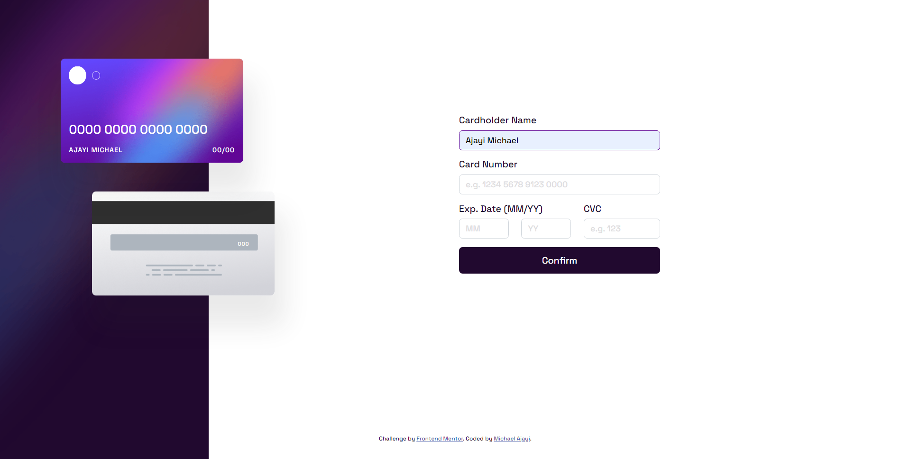

# Frontend Mentor - Interactive card details form solution

This is a solution to the [Interactive card details form challenge on Frontend Mentor](https://www.frontendmentor.io/challenges/interactive-card-details-form-XpS8cKZDWw). Frontend Mentor challenges help you improve your coding skills by building realistic projects. 

## Table of contents

- [Overview](#overview)
  - [The challenge](#the-challenge)
  - [Screenshot](#screenshot)
  - [Links](#links)
- [My process](#my-process)
  - [Built with](#built-with)
  - [What I learned](#what-i-learned)
  - [Continued development](#continued-development)
  - [Useful resources](#useful-resources)
- [Author](#author)

## Overview

### The challenge

Users should be able to:

- Fill in the form and see the card details update in real-time
- Receive error messages when the form is submitted if:
  - Any input field is empty
  - The card number, expiry date, or CVC fields are in the wrong format
- View the optimal layout depending on their device's screen size
- See hover, active, and focus states for interactive elements on the page

### Screenshot

### Links

- Solution URL: [Add solution URL here](https://your-solution-url.com)
- Live Site URL: [Add live site URL here](https://your-live-site-url.com)

## My process

### Built with

- Semantic HTML5 markup
- CSS custom properties
- Flexbox
- CSS Grid
- Mobile-first workflow
- Javascript
- Javascript Methods - String Methods, Date Methods, Number Methods

### What I learned

Learnt more about how css grid can be very useful in a site layout and how it can be used more properly. It is still a complicating code area for me cos' it basically has it's PROs and CONs and can totally deform a site if not used properly.

### Continued development

- Grid Overlapping
- Form Validations

### Useful resources

- [CSS Grid Overlapping](https://www.example.com) - This is an amazing article which helped me finally understand Grid overlapping. I'd recommend it to anyone still learning this concept.
- [Regex Formats](https://www.example.com) - This helped me for knowing the patterns for specific input values. By learning this you get to define what patterns you want your input fields to be; Very useful when making forms.

## Author

- Website - [Michael Ajayi](https://michael-a.netlify.app)
- Frontend Mentor - [@michaelajayi150](https://www.frontendmentor.io/profile/michaelajayi150)
- Twitter - [@michaelajayi150](https://www.twitter.com/michaelajayi150)
- LinkedIn - [@michael-ajayi]
